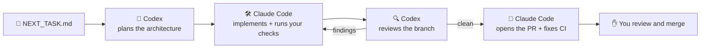

<div align="center">

# Dev Agent Autopilot

### Codex plans. Claude Code builds. Codex reviews. You merge.

A project-agnostic development orchestrator for **Claude Code + Codex + GitHub CI**, designed to remove the manual copy/paste loop between implementation, review, testing, and pull requests.

[](https://github.com/iammurtaza53/dev-agent-autopilot/actions/workflows/ci.yml)
[](LICENSE)
[](package.json)
[](CONTRIBUTING.md)

[Quick start](#quick-start) · [How it works](#how-it-works) · [Demo project](examples/demo-todo-app) · [Commands](#commands) · [FAQ](#faq)

</div>

---

## Stop being the glue between your AI agents

**Without Autopilot:** you ask Claude Code for a feature, copy the diff into Codex for a review, paste the review back, run the tests, paste the failures, push, wait for CI, paste those failures too, and open the PR by hand. You are the message bus.

**With Autopilot:** write the task in `NEXT_TASK.md`, then run:

```bash
dev-autopilot run
```

That's it. The command returns immediately and the work continues in the background:



1. **Codex plans** the task: approach, files to touch, risks and a test plan (read-only, it never edits code).
2. **Claude Code implements** it and runs your real test/lint/build commands until they pass.
3. **Codex reviews** the branch with a fresh pair of eyes. Claude fixes what it finds (up to 3 rounds).
4. **Claude Code pushes**, opens the pull request, watches GitHub CI and fixes task-related failures.
5. **It stops for you.** Merging, deploying and anything risky stay with a human.

## Why Dev Agent Autopilot

- 🌍 **Works with any repository.** Any language, any stack. Your checks are just shell commands.
- 🔑 **Uses the logins you already have.** It drives your installed `claude`, `codex` and `gh` CLIs. No API keys to paste, no new accounts.
- 🧠 **No hard-coded model IDs.** Claude and Codex use whatever models you have configured, so it never goes stale when new models ship.
- ✅ **Real checks, not self-reports.** Your own deterministic test/lint/build commands and GitHub CI decide when the work is done, not the agent's say-so.
- 🤝 **Two agents keep each other honest.** One vendor's model writes the code, another's plans and reviews it.
- 🚀 **Automated PRs and CI monitoring.** Claude opens the pull request, watches CI and fixes failures caused by the task.
- ✋ **Deliberately never auto-merges.** Merges, deploys, store submissions, payments, secrets and DNS stay behind human gates.
- ♻️ **Resumes where it left off.** Close the terminal or reboot, run `dev-autopilot run` again, and the same session picks up with its conversation intact.
- 🪶 **Tiny on purpose.** A few hundred lines of Node that launch Claude Code's native background agents and Codex's native CLI. No custom agent runtime to break.

## The full workflow

Autopilot takes care of the middle of the loop. You keep the product decisions and the merge button.

```text
IDEA
  ↓
Product + architecture planning (ChatGPT, Codex or any assistant)
  ↓
Project brief, phases and decisions saved in the repo
  ↓
Create the repo and the initial codebase
  ↓
dev-autopilot init            (once per project)
  ↓
Write NEXT_TASK.md            (one phase or feature)
  ↓
dev-autopilot run
    Codex plans → Claude implements → checks → Codex reviews
    → Claude fixes → pull request → CI
  ↓
You (or ChatGPT) review the PR, then merge
  ↓
Update NEXT_TASK.md → next run
```

Tip: keep your brief, phases and decisions in files such as `PROJECT_STATE.md`, `ARCHITECTURE.md` and `DECISIONS.md`. Autopilot tells Claude to read them on every run.

---

## Requirements

| Tool | Why | Check |
| --- | --- | --- |
| [Node.js](https://nodejs.org) 22.13+ | runs the launcher | `node --version` |
| Git | branches and commits | `git --version` |
| [GitHub CLI](https://cli.github.com), signed in | pull requests and CI | `gh auth status` |
| [Claude Code](https://github.com/anthropics/claude-code) with background agents (2.1.139+), signed in | the developer | `claude --version`, `claude auth status` |
| [Codex CLI](https://github.com/openai/codex), signed in | the planner and reviewer | `codex --version` |

Your project must be a Git repository with a GitHub remote.

## Quick start

### 1. Install (once per computer)

```bash
git clone https://github.com/iammurtaza53/dev-agent-autopilot.git
cd dev-agent-autopilot
npm install
npm link

dev-autopilot --help
dev-autopilot install-reviewer   # checks that `codex exec` and `codex review` are available
```

Prefer your own copy? [Fork it](https://github.com/iammurtaza53/dev-agent-autopilot/fork) first and clone your fork instead.

### 2. Onboard a project (once per project)

```bash
cd your-project
git switch main && git pull

claude              # first time only: accept the "trust this folder" prompt, then /exit
dev-autopilot init
```

`init` creates two files for you to commit:

- `.autopilot/config.json`: your project settings.
- `.claude/rules/dev-autopilot.md`: the playbook Claude follows.

It also adds `.autopilot/runtime/` and `.claude/worktrees/` to `.gitignore`. Both hold local runtime data that should never be committed. The rest of `.claude/` is left alone, so the committed rule stays tracked.

Open `.autopilot/config.json` and list the commands that prove your code works:

```json
"checks": ["npm run lint", "npm test", "npm run build"]
```

(For other stacks: `["pytest"]`, `["go test ./..."]`, `["cargo test"]` and so on.)

Commit the two files and `.gitignore`, then check everything is ready:

```bash
dev-autopilot doctor
```

### 3. Give it a task and run

Describe the work in `NEXT_TASK.md`: what to build, acceptance criteria, what's out of scope. Commit it, then:

```bash
dev-autopilot run
```

### 4. Watch, then merge

```bash
dev-autopilot status    # sessions and their state
dev-autopilot agents    # Claude Code's live agent view
```

When the PR is ready, review it and merge it yourself, for example:

```bash
gh pr merge <number> --merge --repo OWNER/REPO
```

Skip `--delete-branch` here. Claude Code background sessions work in isolated Git worktrees, and one may still have the PR branch checked out, so deleting the local branch can fail even though the merge succeeds. Tidy up local branches later (see the [FAQ](#faq)).

Update `NEXT_TASK.md` and run again for the next task.

> **Want to see it work first?** The [demo project](examples/demo-todo-app) is a tiny Node app with a ready-made task. It takes about ten minutes.

---

## Commands

Every command takes an optional project path and otherwise uses the current folder.

| Command | What it does |
| --- | --- |
| `dev-autopilot init` | Onboard a project: write the config and Claude rule |
| `dev-autopilot doctor` | Check Git, GitHub CLI, Claude Code, Codex and your logins |
| `dev-autopilot run` | Start the task in `NEXT_TASK.md`, or resume its existing session |
| `dev-autopilot status` | Show this project's Claude background sessions |
| `dev-autopilot agents` | Open Claude Code's native agent view |
| `dev-autopilot logs <id>` | Show recent output from a session |
| `dev-autopilot attach <id>` | Jump into a session, e.g. to answer a question |
| `dev-autopilot stop <id>` | Stop a session |
| `dev-autopilot resume <id>` | Restart a stopped or failed session with its conversation intact |
| `dev-autopilot upgrade` | Refresh the Claude rule and `.gitignore` after updating Autopilot |
| `dev-autopilot install-reviewer` | Check that `codex exec` and `codex review` are available |
| `dev-autopilot migrate-v1` | Convert a legacy v0.1 project config |

## Configuration

`.autopilot/config.json`, trimmed to the parts you'll usually touch:

```json
{
  "project": {
    "baseBranch": "main",
    "taskFile": "NEXT_TASK.md",
    "contextFiles": ["CLAUDE.md", "AGENTS.md", "PROJECT_STATE.md", "DECISIONS.md", "ARCHITECTURE.md"]
  },
  "checks": ["npm run lint", "npm test"],
  "planner": { "enabled": true, "command": "codex exec --sandbox read-only" },
  "reviewer": { "command": "codex review", "maxRounds": 3 },
  "claude": { "allowedTools": ["..."], "disallowedTools": ["..."] },
  "safety": { "requireCleanStart": true, "humanGates": ["..."] }
}
```

| Setting | Meaning |
| --- | --- |
| `project.taskFile` | The file that describes the current task |
| `project.contextFiles` | Docs Claude reads first (missing files are fine) |
| `checks` | Commands that must pass before the work counts as done |
| `planner.enabled` | Set to `false` to skip the Codex planning step |
| `reviewer.maxRounds` | How many Codex review/fix rounds before Claude reports a blocker |
| `claude.allowedTools` | What Claude may run unattended. Add your check commands here if they aren't covered (e.g. `Bash(make *)`) |
| `claude.disallowedTools` | Commands that are always refused |
| `safety.requireCleanStart` | Refuse to launch from a checkout with uncommitted changes |
| `safety.humanGates` | Situations where Claude must stop and hand over to you |

## Safety

Autopilot runs agents unattended, so the defaults are conservative:

- **Never merges.** `gh pr merge` is denied, and the rule tells Claude to stop at a ready-for-review PR.
- **No destructive Git.** Force pushes, `git reset --hard` and `git clean -f` are denied.
- **No publishing.** `npm`/`pnpm`/`yarn`/`bun`/`cargo publish`, NuGet push, Maven deploy, Gradle publish and EAS submit/update are denied.
- **Allow-list only.** Sessions run in `dontAsk` mode: anything not in `allowedTools` is refused instead of prompting.
- **Human gates.** Production deploys, app-store submissions, payments, legal or financial steps, identity/2FA, production secrets, destructive data changes, DNS and physical-device testing always come back to you.
- **Codex is read-only.** It plans in a read-only sandbox and reviews without editing files.
- **Isolated work.** Claude Code background sessions work in their own Git worktree (under the git-ignored `.claude/worktrees/`), not your checkout.

Autopilot is not a sandbox. Claude runs on your machine with your accounts and whatever you allow, so review `allowedTools` before your first run.

## How it works

Autopilot is a thin launcher. The heavy lifting is done by features Claude Code and Codex already ship:

- `dev-autopilot run` checks that your tree is clean, fingerprints `NEXT_TASK.md`, and asks `claude agents` whether a session already exists for that exact task.
  - **Working:** tells you where to watch.
  - **Stopped or failed:** respawns it.
  - **Blocked on a question:** tells you how to attach.
  - **Done:** says so.
  - **None yet:** launches a new Claude Code background session (`claude --bg`) with permissions generated from your config.
- Claude follows `.claude/rules/dev-autopilot.md`, the committed playbook for planning with `codex exec`, implementing, running checks, reviewing with `codex review`, opening the PR and watching CI.
- The session outlives your terminal. After a reboot, run `dev-autopilot run` again to resume it.

## FAQ

**Is it free?**
Yes. Autopilot is MIT-licensed: use it, fork it, change it. It runs on your existing Claude Code and Codex plans, and their usage counts against those plans as normal.

**Which models does it use?**
Whatever your `claude` and `codex` CLIs are configured to use. There are no model IDs anywhere in Autopilot.

**Can I plan elsewhere and skip Codex planning?**
Yes. Set `"planner": { "enabled": false }`. Codex still reviews every branch. Many people plan the product in ChatGPT, keep the phases in the repo and let Autopilot run one phase at a time.

**Windows, macOS or Linux?**
All three. It's developed on Windows and CI runs the test suite on Windows, macOS and Linux.

**`run` says "Workspace not trusted".**
Run `claude` once inside the project, accept the trust prompt, `/exit`, then run again.

**`run` says "Working tree is dirty".**
Commit or stash your changes first, so the background task starts from a known state.

**What if it gets stuck?**
`dev-autopilot status` shows the state. If a session is blocked, `dev-autopilot attach <id>` lets you answer it. Codex review loops stop after `reviewer.maxRounds` and report a blocker instead of looping forever.

**Deleting the local branch after a merge fails.**
The branch is probably still checked out in the Claude session's worktree. The merge on GitHub is unaffected. After the session has ended, `git worktree list` shows the worktree; remove it with `git worktree remove <path>`, then run `git branch -d <branch>`. If Git reports the worktree as locked, Claude Code is still holding it, so leave it for now.

**I'm upgrading from an earlier version.**
Pull the latest Autopilot, then run `dev-autopilot upgrade` in each project and commit the result. It refreshes the Claude rule, adds `.claude/worktrees/` to `.gitignore`, and adds the Codex planner if it's missing (you can switch it off).

## Contributing

Issues and pull requests are welcome. See [CONTRIBUTING.md](CONTRIBUTING.md). If Autopilot saves you some copy/paste, a ⭐ helps other people find it.

## License

[MIT](LICENSE)
