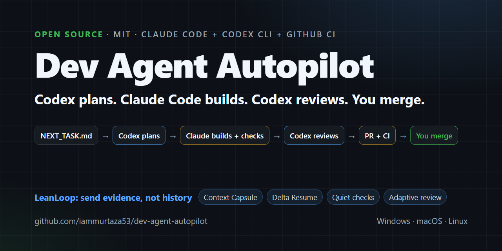
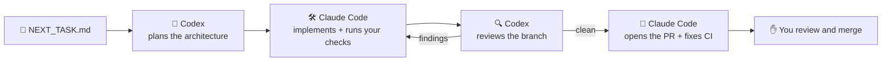

<div align="center">

# Dev Agent Autopilot

### Codex plans. Claude Code builds. Codex reviews. You merge.

A project-agnostic development orchestrator for **Claude Code + Codex + GitHub CI**, designed to remove the manual copy/paste loop between implementation, review, testing, and pull requests.

[](https://github.com/iammurtaza53/dev-agent-autopilot/actions/workflows/ci.yml)
[](LICENSE)
[](package.json)
[](CONTRIBUTING.md)

[Quick start](#quick-start) · [LeanLoop](#leanloop-send-evidence-not-history) · [How it works](#how-it-works) · [Demo project](examples/demo-todo-app) · [Commands](#commands) · [FAQ](#faq) · [Related projects](#related-projects)

</div>



---

## Stop being the glue between your AI agents

**Without Autopilot:** you ask Claude Code for a feature, copy the diff into Codex for a review, paste the review back, run the tests, paste the failures, push, wait for CI, paste those failures too, and open the PR by hand. You are the message bus.

**With Autopilot:** write the task in `NEXT_TASK.md`, then run:

```bash
dev-autopilot run
```

That's it. The command returns immediately and the work continues in the background:



1. **Codex plans** the task: approach, files to touch, risks and a test plan (read-only, it never edits code).
2. **Claude Code implements** it and runs your real test/lint/build commands until they pass.
3. **Codex reviews** the branch with a fresh pair of eyes. Claude fixes what it finds, within a review budget set by the diff: none for docs-only changes, one round for small ones, up to `reviewer.maxRounds` (2 by default) for the rest. If Codex can't run, Claude stops and tells you rather than reviewing its own work.
4. **Claude Code pushes**, opens the pull request, watches GitHub CI and fixes task-related failures.
5. **It stops for you.** Merging, deploying and anything risky stay with a human.

## Why Dev Agent Autopilot

- 🌍 **Works with any repository.** Any language, any stack. Your checks are just shell commands.
- 🔑 **Uses the logins you already have.** It drives your installed `claude`, `codex` and `gh` CLIs. No API keys to paste, no new accounts.
- 🧠 **No hard-coded model IDs.** Claude and Codex use whatever models you have configured, so it never goes stale when new models ship.
- ✅ **Real checks, not self-reports.** Your own deterministic test/lint/build commands and GitHub CI decide when the work is done, not the agent's say-so.
- 🤝 **Two agents keep each other honest.** One vendor's model writes the code, another's plans and reviews it.
- 🚀 **Automated PRs and CI monitoring.** Claude opens the pull request, watches CI and fixes failures caused by the task.
- ✋ **Deliberately never auto-merges.** Merges, deploys, store submissions, payments, secrets and DNS stay behind human gates.
- ♻️ **Resumes where it left off.** Close the terminal or reboot, run `dev-autopilot run` again, and the same session picks up with its conversation intact. It is told what changed since it last read the context, and only that.
- 🧮 **LeanLoop: send evidence, not history.** Deterministic Context Capsules, quiet checks and an adaptive review budget cut the text Autopilot puts in front of the agents by 77% on our benchmark, without an extra model and without hiding a failure. [More below](#leanloop-send-evidence-not-history).
- 🛡️ **Optional trust-handoff gate.** Switch on [HostLatch](#trust-handoff-with-hostlatch-optional) and every check run also flags agent-written changes that could later run with your authority, such as install scripts, IDE tasks, agent hooks and CI workflows.
- 🪶 **Small on purpose.** A small Node launcher that starts Claude Code's native background agents and uses Codex's native CLI. No custom agent runtime to break.

## Who does what

Claude Code and Codex can already work together without Autopilot. OpenAI publishes an official [Codex plugin for Claude Code](https://github.com/openai/codex-plugin-cc) that adds `/codex:review`, `/codex:adversarial-review` and more. Autopilot is the opinionated layer around them: it takes one task from `NEXT_TASK.md` to a CI-checked pull request, and then stops for you.

| Part | Owns |
| --- | --- |
| **Dev Agent Autopilot** | The task lifecycle: launching and resuming the background session, the workflow rule Claude follows, per-session permissions, the bounded review loop, status and cleanup, and the human gates |
| **Claude Code** | Background sessions and their worktrees, implementation, your checks, Git, the pull request and CI fixes |
| **Codex CLI** | Read-only planning (`codex exec --sandbox read-only`) and the automated review loop (`codex review --base <branch>`) |
| **Official Codex plugin** (optional) | Reviews you start yourself inside Claude Code, such as a challenge review of Autopilot's pull request with `/codex:adversarial-review --base main` |
| **You** | The task, the review of the pull request, the merge and anything behind a human gate |

**Why the automated reviewer is still the native Codex CLI.** The plugin's review commands are marked `disable-model-invocation: true`, so only a person can run them. An unattended Autopilot session is a model, and the plugin offers no other supported interface for unattended use. Autopilot therefore keeps `codex review` as its reviewer and treats the plugin as a companion for your own reviews. Autopilot also switches the plugin off inside its own background sessions. That way the plugin's optional Stop-time review gate can't start a second, unbounded review loop, and Claude can't hand code changes to Codex. The details and the evidence are in [docs/codex-plugin.md](docs/codex-plugin.md).

## The full workflow

Autopilot takes care of the middle of the loop. You keep the product decisions and the merge button.

```text
IDEA
  ↓
Product + architecture planning (ChatGPT, Codex or any assistant)
  ↓
Project brief, phases and decisions saved in the repo
  ↓
Create the repo and the initial codebase
  ↓
dev-autopilot init            (once per project)
  ↓
Write NEXT_TASK.md            (one phase or feature)
  ↓
dev-autopilot run
    Codex plans → Claude implements → checks → Codex reviews
    → Claude fixes → pull request → CI
  ↓
You (or ChatGPT) review the PR, then merge
  ↓
Update NEXT_TASK.md → next run
```

Tip: keep your brief, phases and decisions in files such as `PROJECT_STATE.md`, `ARCHITECTURE.md` and `DECISIONS.md`. For every task, Autopilot builds a Context Capsule from them: the task verbatim, your mandatory rules, and the sections that matter to this task.

## LeanLoop: send evidence, not history

Long agent runs spend much of their context on material the agent doesn't need: every project document at the start of every task, thousands of lines of passing test output, and review rounds a docs fix never needed. LeanLoop (new in v0.4.1) trims that at the orchestration layer, before it reaches Claude or Codex. It never asks a model to summarize anything: it works with hashes, Markdown sections, git diffs and exit codes, and your repository files stay the source of truth.

- **Context Capsule.** One file per task in place of "read all the context files". It has the task verbatim, your instruction files and safety sections in full, and the sections that the task's paths, identifiers and references point to. Each excerpt is exact text with its path, lines and sha256. Everything else is indexed by line range so Claude can read just what it needs.
- **Delta Resume.** A stopped session gets a short "nothing changed, carry on" message, or a delta with only the sections that changed. It never gets the whole context again, and it never keeps stale context.
- **Quiet Checks.** `dev-autopilot check` keeps full logs on disk and shows `PASS  npm test (6.9s) · 93 passed`, or for a failure the exit code, the log path and a bounded excerpt. It also reuses a pass for an unchanged tree.
- **Adaptive Codex review.** The git diff decides the review budget. Docs-only changes skip Codex review, small changes get one round, and security, payments, migrations, dependencies, CI, build or agent-instruction changes get the full `reviewer.maxRounds`. A clean review always ends the loop.
- **No duplicate planning.** The planner never runs when `planner.enabled` is off, and never plans the same task twice.
- **Quota resume tickets (opt-in).** When Claude or Codex reports an exhausted usage limit *with* a stated reset time, Autopilot can resume the session at reset + 2 minutes, after checking it is still the same task. It never guesses a reset time, buys credits or uses banked resets.
- **Local efficiency report.** `dev-autopilot efficiency` shows the bytes kept out of agent context. Everything stays on your machine; token figures are labelled estimates.

On the [benchmark](bench/README.md) (a realistic service with 23 KB of context docs and verbose tests, compared with v0.4.0's exact prompt and rule), agent-facing text drops from 281 KB to 66 KB (77% less), and all 21 required-information checks pass. Quiet checks are the biggest part; without check output the reduction is 38%. These are orchestration-layer bytes, not provider-billed tokens.

Claude Code and Codex also compact context themselves. LeanLoop is complementary: it decides what reaches them in the first place. The full design, settings and limitations are in [docs/leanloop.md](docs/leanloop.md).

---

## Requirements

| Tool | Why | Check |
| --- | --- | --- |
| [Node.js](https://nodejs.org) 22.13+ | runs the launcher | `node --version` |
| Git | branches and commits | `git --version` |
| [GitHub CLI](https://cli.github.com), signed in | pull requests and CI | `gh auth status` |
| [Claude Code](https://github.com/anthropics/claude-code) with background agents (2.1.139+), signed in | the developer | `claude --version`, `claude auth status` |
| [Codex CLI](https://github.com/openai/codex), signed in | the planner and reviewer | `codex --version`, `codex login status` |
| [Codex plugin for Claude Code](https://github.com/openai/codex-plugin-cc) (optional) | your own `/codex:review` and `/codex:adversarial-review` runs | `dev-autopilot doctor` |

Your project must be a Git repository with a GitHub remote.

## Quick start

### 1. Install (once per computer)

```bash
git clone https://github.com/iammurtaza53/dev-agent-autopilot.git
cd dev-agent-autopilot
npm install
npm link

dev-autopilot --help
dev-autopilot install-reviewer   # checks `codex exec`, `codex review` and your Codex login, and looks for the Codex plugin
```

No clone needed: install a tagged release straight from GitHub (Node.js 22.13+). Autopilot isn't on the npm registry.

```bash
# Try a command once
npx --yes github:iammurtaza53/dev-agent-autopilot#v0.4.2 --help

# Install for real use; Autopilot sessions call `dev-autopilot` by name, so it must be on PATH
npm install -g github:iammurtaza53/dev-agent-autopilot#v0.4.2
```

Optional: install OpenAI's Codex plugin for Claude Code for reviews you start yourself. Inside Claude Code:

```text
/plugin marketplace add openai/codex-plugin-cc
/plugin install codex@openai-codex
/reload-plugins
/codex:setup
```

Or run `dev-autopilot install-reviewer --install-plugin` in a terminal. It shows the two `claude plugin` commands it will run and waits for your yes. Autopilot never installs the plugin or changes its review gate on its own.

Prefer your own copy? [Fork it](https://github.com/iammurtaza53/dev-agent-autopilot/fork) first and clone your fork instead.

### 2. Onboard a project (once per project)

```bash
cd your-project
git switch main && git pull

claude              # first time only: accept the "trust this folder" prompt, then /exit
dev-autopilot init
```

`init` creates two files for you to commit:

- `.autopilot/config.json`: your project settings.
- `.claude/rules/dev-autopilot.md`: the playbook Claude follows.

It also adds `.autopilot/runtime/` and `.claude/worktrees/` to `.gitignore`. Both hold local runtime data that should never be committed. The rest of `.claude/` is left alone, so the committed rule stays tracked.

Open `.autopilot/config.json` and list the commands that prove your code works:

```json
"checks": ["npm run lint", "npm test", "npm run build"]
```

(For other stacks: `["pytest"]`, `["go test ./..."]`, `["cargo test"]` and so on.)

Commit the two files and `.gitignore`, then check everything is ready:

```bash
dev-autopilot doctor
```

### 3. Give it a task and run

Describe the work in `NEXT_TASK.md`: what to build, acceptance criteria, what's out of scope. Commit it, then:

```bash
dev-autopilot run
```

### 4. Watch, then merge

```bash
dev-autopilot status    # sessions and their state
dev-autopilot agents    # Claude Code's live agent view
```

`status` marks each session as `active`, `current` (it finished the task in `NEXT_TASK.md`) or `stale` (it finished an earlier task). To attach, read logs, stop or resume, pass the session's `id` (such as `7c5dcf5d`). The full `sessionId` works too.

Want a second opinion before you merge? If you installed the official Codex plugin, open Claude Code on the PR branch and run `/codex:adversarial-review --base main`. It's a steerable challenge review that you start yourself.

When the PR is ready, review it and merge it yourself, for example:

```bash
gh pr merge <number> --merge --repo OWNER/REPO
```

Skip `--delete-branch` here. Claude Code background sessions work in isolated Git worktrees, and one may still have the PR branch checked out, so deleting the local branch can fail even though the merge succeeds. Tidy up local branches later (see the [FAQ](#faq)).

Update `NEXT_TASK.md` and run again for the next task.

> **Want to see it work first?** The [demo project](examples/demo-todo-app) is a tiny Node app with a ready-made task. It takes about ten minutes.

---

## Commands

Every command takes an optional project path and otherwise uses the current folder.

| Command | What it does |
| --- | --- |
| `dev-autopilot init` | Onboard a project: write the config and Claude rule |
| `dev-autopilot doctor` | Check Git, GitHub CLI, Claude Code, Codex, your logins, the reviewer and the optional Codex plugin |
| `dev-autopilot run` | Start the task in `NEXT_TASK.md`, or resume its existing session |
| `dev-autopilot status` | Show this project's background sessions as active, current or stale |
| `dev-autopilot agents` | Open Claude Code's native agent view |
| `dev-autopilot logs <id>` | Show recent output from a session |
| `dev-autopilot attach <id>` | Jump into a session, e.g. to answer a question |
| `dev-autopilot stop <id>` | Stop a session |
| `dev-autopilot resume <id>` | Restart a stopped or failed session with its conversation intact |
| `dev-autopilot cleanup [--apply]` | List finished Autopilot sessions from earlier tasks; `--apply` removes them with `claude rm` |
| `dev-autopilot upgrade` | Refresh the Claude rule and `.gitignore` after updating Autopilot |
| `dev-autopilot install-reviewer [--install-plugin]` | Check `codex exec`, `codex review` and your Codex login; check for the Codex plugin, or install it after you confirm |
| `dev-autopilot migrate-v1` | Convert a legacy v0.1 project config |
| `dev-autopilot efficiency [--json] [--task]` | Local LeanLoop metrics: context, check output and review rounds kept out of agent context |
| `dev-autopilot capsule [--print]` | Build (or reuse) the Context Capsule for the current task and show its size |

`<id>` is the short `id` from `dev-autopilot status`. The full `sessionId` or the session name also works. `stop <id>` also cancels a scheduled quota resume for that session.

Autopilot sessions call these LeanLoop helpers themselves, and you can run them by hand too:

| Command | What it does |
| --- | --- |
| `dev-autopilot check [--force] [--bail] [--only <check>]` | Run the configured checks quietly: full logs on disk, PASS/FAIL lines on screen |
| `dev-autopilot check --log <check>` | Print the full stored log of a check's latest run |
| `dev-autopilot codex plan [--force]` | Ask Codex for a read-only plan once per unchanged task (only when `planner.enabled` is `true`) |
| `dev-autopilot codex review` | Run the native `codex review --base <branch>` under the adaptive review budget |
| `dev-autopilot review-budget [--json]` | Show how many review rounds the current diff gets, and why |
| `dev-autopilot state [--pr <n>] [--ci <state>] [--status <state>] [--blocker <text>]` | Show or record the task's compact orchestration state |

## Configuration

`.autopilot/config.json`, trimmed to the parts you'll usually touch:

```json
{
  "project": {
    "baseBranch": "main",
    "taskFile": "NEXT_TASK.md",
    "contextFiles": ["CLAUDE.md", "AGENTS.md", "PROJECT_STATE.md", "DECISIONS.md", "ARCHITECTURE.md"]
  },
  "checks": ["npm run lint", "npm test"],
  "planner": { "enabled": true, "command": "codex exec --sandbox read-only" },
  "reviewer": { "transport": "codex-cli", "command": "codex review", "maxRounds": 2, "adaptive": { "enabled": true } },
  "leanloop": { "enabled": true },
  "quota": { "autoResume": false, "graceMinutes": 2 },
  "codexPlugin": { "loadInAutopilotSessions": false },
  "claude": { "allowedTools": ["..."], "disallowedTools": ["..."] },
  "safety": { "requireCleanStart": true, "humanGates": ["..."] }
}
```

| Setting | Meaning |
| --- | --- |
| `project.taskFile` | The file that describes the current task |
| `project.contextFiles` | Docs the Context Capsule is built from (missing files are fine) |
| `checks` | Commands that must pass before the work counts as done. Strings, or `{ "name", "command" }` objects |
| `planner.enabled` | Set to `false` to skip the Codex planning step, for example when the task already contains the plan or you plan elsewhere. Codex still reviews |
| `reviewer.transport` | The automated reviewer backend. `codex-cli` (native `codex review`) is the only one, so there is no fallback to choose. Other values are rejected with an explanation |
| `reviewer.maxRounds` | The strict maximum number of Codex review/fix rounds (a whole number, 1 or more) before Claude reports a blocker. New projects get 2; existing configs keep their value |
| `reviewer.adaptive` | The review budget from the diff (docs-only 0, small 1, other 2, high-risk `maxRounds`). All thresholds and extra high-risk paths/keywords are configurable; `false` keeps a fixed `maxRounds`. See [docs/leanloop.md](docs/leanloop.md#adaptive-codex-review) |
| `leanloop.enabled` | `true` (the default, also when missing) turns on the Context Capsule, Delta Resume and the quiet helpers. `false` keeps v0.4.0 behaviour exactly. Capsule and check options are in [docs/leanloop.md](docs/leanloop.md#configuration) |
| `quota.autoResume` | `false` (the default). `true` lets Autopilot resume a task after a usage limit resets, but only when Claude or Codex states the reset time. `quota.graceMinutes` (default 2) is added to it |
| `trustGate` | `{ "enabled": false, "command": "hostlatch", "failOn": "block" }` by default. `enabled: true` runs [HostLatch](https://github.com/iammurtaza53/hostlatch) on every `dev-autopilot check`. See [Trust handoff with HostLatch](#trust-handoff-with-hostlatch-optional) |
| `codexPlugin.loadInAutopilotSessions` | `false` (the default, also used when the key is missing) switches the official Codex plugin off inside Autopilot's background sessions. `true` leaves it as your Claude Code settings have it. Doctor and `run` then warn that the plugin's review gate, if you enabled it, would run alongside `reviewer.maxRounds` |
| `claude.allowedTools` | What Claude may run unattended. Add your check commands here if they aren't covered (e.g. `Bash(make *)`) |
| `claude.disallowedTools` | Commands that are always refused |
| `safety.requireCleanStart` | Refuse to launch from a checkout with uncommitted changes |
| `safety.humanGates` | Situations where Claude must stop and hand over to you |

## Safety

Autopilot runs agents unattended, so the defaults are conservative:

- **Never merges.** `gh pr merge` is denied, and the rule tells Claude to stop at a ready-for-review PR.
- **No destructive Git.** Force pushes, `git reset --hard` and `git clean -f` are denied.
- **No publishing.** `npm`/`pnpm`/`yarn`/`bun`/`cargo publish`, NuGet push, Maven deploy, Gradle publish and EAS submit/update are denied.
- **Allow-list only.** Sessions run in `dontAsk` mode: anything not in `allowedTools` is refused instead of prompting.
- **Human gates.** Production deploys, app-store submissions, payments, legal or financial steps, identity/2FA, production secrets, destructive data changes, DNS and physical-device testing always come back to you.
- **Codex is read-only.** It plans in a read-only sandbox and reviews without editing files. Sessions also deny the Codex plugin's write-capable `codex:codex-rescue` subagent, `/codex:rescue` and `/codex:setup`.
- **One bounded review loop.** The Codex plugin is switched off inside Autopilot sessions, so its optional Stop-time review gate can't add a second review loop on top of `reviewer.maxRounds`. This applies to that session only; your own Claude Code sessions and settings are untouched.
- **Review is never weakened for risky changes.** The adaptive budget only lowers rounds for docs-only and small low-risk diffs. Security, payments, migrations, secrets, deployment, dependencies, CI, build configuration and agent instructions always get the full `reviewer.maxRounds`, and a code change can't be configured down to zero rounds.
- **Codex failures stop the run.** If Codex can't plan or review (not signed in, out of usage, offline), Claude reports a blocker instead of reviewing its own work.
- **Quota resume is opt-in and conservative.** It needs `quota.autoResume: true` and a reset time the CLI itself states. It re-checks the project, the task and the session before resuming, and `dev-autopilot stop` cancels it. It never buys credits or changes billing.
- **LeanLoop never hides a failure or captures secrets.** Failing checks always show the exit code, the log path and an excerpt, and the full log stays on disk. The Context Capsule and its cache skip git-ignored and credential-named files, and withhold sections that contain credential-like values.
- **Narrow session permissions.** Sessions may call only `dev-autopilot check`, `codex plan`, `codex review`, `review-budget` and `state`, never `run`, `stop` or `cleanup`.
- **No credential handling.** Autopilot uses the logins the `claude`, `codex` and `gh` CLIs already manage. It checks them by exit code only, and never reads, prints or stores tokens.
- **Isolated work.** Claude Code background sessions work in their own Git worktree (under the git-ignored `.claude/worktrees/`), not your checkout.

Autopilot is not a sandbox. Claude runs on your machine with your accounts and whatever you allow, so review `allowedTools` before your first run.

## Trust handoff with HostLatch (optional)

An agent's sandbox ends when its work lands in your repository. What it changed there can still run later with your authority: when you install dependencies, open the folder in your IDE, let CI run, or start the next agent session. [HostLatch](https://github.com/iammurtaza53/hostlatch), by the same author, finds those changes: package lifecycle scripts, IDE tasks, agent hooks and settings, MCP commands, CI workflows, Git attributes and dev containers.

Switch it on per project:

```json
"trustGate": { "enabled": true, "command": "hostlatch", "failOn": "block" }
```

Install HostLatch with `npm install -g github:iammurtaza53/hostlatch#v0.2.0`, or skip the install with `"command": "npx --yes github:iammurtaza53/hostlatch#v0.2.0"`.

With the gate on:

- **Every `dev-autopilot check` ends with a HostLatch scan of the task branch against the base branch.** It prints one line when the scan is clean. Otherwise it shows the decision, the findings (rule, path, title; the evidence stays in the stored manifest) and the manifest path. `failOn` sets what fails the check: `block` (the default), or `review` as well. `dev-autopilot check --only trust` runs only the scan.
- **Anything HostLatch flags gets the full Codex review budget**, `reviewer.maxRounds`, whatever the size of the diff.
- **The Claude rule says what to do with a finding.** Remove a change the task doesn't need. List a needed one under "Trust handoff (HostLatch)" in the pull request. Treat a `block` as a human gate and stop before merge. Never rewrite or hide a change to pass the scan.
- **`status` shows the last decision, and `doctor` checks that HostLatch runs.** If the gate is on and HostLatch can't run, every check fails instead of passing silently.

You can also use HostLatch without the gate. Scan a branch an Autopilot session produced before you merge it: `hostlatch scan . --base origin/main`.

## How it works

Autopilot is a thin launcher. The heavy lifting is done by features Claude Code and Codex already ship:

- `dev-autopilot run` checks that your tree is clean, fingerprints `NEXT_TASK.md`, and asks `claude agents` whether a session already exists for that exact task.
  - **Working:** tells you where to watch.
  - **Stopped or failed:** continues it with `claude --bg --resume`: a short message when nothing changed, or a delta of the changed context.
  - **Blocked on a question:** tells you how to attach.
  - **Done:** says so (or continues it if it stopped at a usage limit that has since reset).
  - **None yet:** builds the Context Capsule, then launches a new Claude Code background session (`claude --bg`) with session settings generated from your config: the permission allow/deny lists, plus `"enabledPlugins": {"codex@openai-codex": false}` unless you opted in.
- Claude follows `.claude/rules/dev-autopilot.md`, the committed playbook for planning with `dev-autopilot codex plan`, implementing, running checks with `dev-autopilot check`, reviewing with `dev-autopilot codex review` (native `codex review`) within the review budget, opening the PR and watching CI.
- Runtime state (the capsule, check logs, Codex transcripts, the compact task state and the efficiency ledger) lives in the git-ignored `.autopilot/runtime/`.
- The session outlives your terminal. After a reboot, run `dev-autopilot run` again to resume it.

## FAQ

**Is it free?**
Yes. Autopilot is MIT-licensed: use it, fork it, change it. It runs on your existing Claude Code and Codex plans, and their usage counts against those plans as normal.

**Which models does it use?**
Whatever your `claude` and `codex` CLIs are configured to use. There are no model IDs anywhere in Autopilot.

**Can I plan elsewhere and skip Codex planning?**
Yes. Set `"planner": { "enabled": false }`. Codex still reviews every branch. Many people plan the product in ChatGPT, keep the phases in the repo and let Autopilot run one phase at a time.

**Windows, macOS or Linux?**
All three. It's developed on Windows and CI runs the test suite on Windows, macOS and Linux.

**`run` says "Workspace not trusted".**
Run `claude` once inside the project, accept the trust prompt, `/exit`, then run again.

**`run` says "Working tree is dirty".**
Commit or stash your changes first, so the background task starts from a known state.

**What if it gets stuck?**
`dev-autopilot status` shows the state. If a session is blocked, `dev-autopilot attach <id>` lets you answer it. Codex review loops stop at the review budget (never more than `reviewer.maxRounds`) and report a blocker instead of looping forever.

**How much does LeanLoop save me?**
Run `dev-autopilot efficiency` in a project after a few tasks. It reports the bytes of context, check output and Codex text kept out of the agents' context, measured locally. The saving depends on your context docs and how verbose your checks are. Autopilot can't see provider-billed tokens, so any token figure it shows is a labelled estimate.

**What happens when Claude or Codex runs out of usage?**
Codex usage errors stop the session with a quota blocker instead of a retry loop. If the CLI states when the limit resets and you set `"quota": { "autoResume": true }`, Autopilot schedules a resume for 2 minutes after that time and `status` shows `waiting-quota`. It re-checks that the task is unchanged and still waiting before resuming, and `dev-autopilot stop <id>` cancels it. Without a stated reset time, it stops with "quota exhausted; reset time unavailable for automatic scheduling": run `dev-autopilot run` once your limit is back. The scheduler is a small background process, so after a reboot the next `dev-autopilot` command re-arms it.

**`status` shows both `id` and `sessionId`. Which one do I use?**
Either. Claude Code's own `claude attach`, `logs`, `stop` and `respawn` accept only the short `id`. From v0.4, `dev-autopilot attach`, `logs`, `stop` and `resume` also accept the full `sessionId` or the session name and pass Claude the short id. If nothing matches, Autopilot tells you which value to use instead of passing the error through.

**Old sessions are still listed in the agent view.**
That's how Claude Code works: finished background sessions stay listed until you delete them. `dev-autopilot status` labels them `stale` once `NEXT_TASK.md` has moved on. `dev-autopilot cleanup` lists the finished Autopilot sessions from earlier tasks, and `dev-autopilot cleanup --apply` removes them with `claude rm <id>`. Transcripts stay available through `claude --resume`, and Claude keeps any worktree that has uncommitted changes or unpushed commits. Cleanup never touches active sessions, sessions of the current task, sessions it didn't start, or your own checkout.

**Should I use `/codex:review` from the Codex plugin, or Autopilot's review?**
Both have a place. Autopilot's unattended loop runs the native `codex review --base <branch>`, which the plugin's README describes as the same review. The plugin is for reviews you start yourself in Claude Code, especially `/codex:adversarial-review` to challenge a pull request's design before you merge. Leave the plugin's review gate (`/codex:setup --enable-review-gate`) off in Autopilot projects. Autopilot already bounds its own review loop and switches the plugin off inside its sessions. See [docs/codex-plugin.md](docs/codex-plugin.md).

**Doctor says Codex is signed in, but the run stopped with a Codex error.**
`codex login status` confirms the login, not your remaining usage or credits. When Codex can't plan or review, the session stops and reports the Codex error. Fix the account, then `dev-autopilot attach <id>` and ask Claude to continue, or run `dev-autopilot run` again.

**Deleting the local branch after a merge fails.**
The branch is probably still checked out in the Claude session's worktree. The merge on GitHub is unaffected. After the session has ended, `git worktree list` shows the worktree; remove it with `git worktree remove <path>`, then run `git branch -d <branch>`. If Git reports the worktree as locked, Claude Code is still holding it, so leave it for now.

**I'm upgrading from an earlier version.**
Pull the latest Autopilot, then run `dev-autopilot upgrade` in each project and commit the result:

```bash
cd dev-agent-autopilot && git pull && npm install
cd your-project
dev-autopilot upgrade
dev-autopilot doctor
git add .claude/rules/dev-autopilot.md .gitignore .autopilot/config.json
git commit -m "chore: upgrade Dev Agent Autopilot"
```

`upgrade` refreshes the Claude rule, adds `.claude/worktrees/` to `.gitignore`, and adds the Codex planner if it's missing (you can switch it off). It's safe to run repeatedly.

Upgrading from v0.3.x to v0.4 needs no config changes, and the config file is left exactly as it was. The new `codexPlugin` setting is optional, and the plugin itself isn't required. After upgrading, sessions that `run` or `resume` starts or respawns get the new settings, with the plugin switched off inside them.

Upgrading to v0.4.1 needs no config changes either: LeanLoop is on with its defaults, quota auto-resume stays off, and your `reviewer.maxRounds` is kept as the cap. Run `dev-autopilot upgrade` and commit the refreshed rule; `doctor` warns while the committed rule is from an older version. Make sure `dev-autopilot` is on PATH (`npm link`), because sessions call its LeanLoop helpers. To keep v0.4.0 behaviour exactly, set `"leanloop": { "enabled": false }`.

Upgrading to v0.4.2 needs no config change either. The HostLatch trust gate stays off until you add `"trustGate": { "enabled": true }`. Run `dev-autopilot upgrade` to refresh the rule, which now says how to handle HostLatch findings.

## Related projects

Autopilot is one of several tools built around the same idea, and some go further in particular directions. If one of them fits your workflow better, use it. This list isn't exhaustive.

**Companion project (same author)**

- [HostLatch](https://github.com/iammurtaza53/hostlatch): a trust-handoff firewall for AI-written repositories. Before a trusted host (Git, an IDE, a package manager, CI or the next agent session) acts on an agent's changes, it checks the files that could run with your authority: agent hooks and settings, MCP commands, IDE tasks, package lifecycle scripts and CI workflows. It pairs with Autopilot: run `hostlatch scan . --base origin/main` on a branch an Autopilot session produced, before you merge it.

**Claude Code with Codex (or another reviewer) in a loop**

- [openai/codex-plugin-cc](https://github.com/openai/codex-plugin-cc): OpenAI's official Codex plugin for Claude Code, with `/codex:review`, `/codex:adversarial-review` and an optional Stop-time review gate. Autopilot works alongside it; see [docs/codex-plugin.md](docs/codex-plugin.md).
- [coding-review-agent-loop](https://github.com/wwind123/coding-review-agent-loop): a local plan, code and multi-reviewer pull-request loop over your existing `claude`, `codex`, `gemini` and `gh` logins, with managed CI and resumable rounds. It is broader than Autopilot, with several reviewers and plan decomposition.
- [claude-codex-loop](https://github.com/vibecodedapps-official/claude-codex-loop): a prompt-only Claude Code plugin. It plans, has Codex review the plan and the code, runs checks, opens the pull request and watches CI, and scales review depth by effort and risk.
- [claude-review-loop](https://github.com/jcszymansk/claude-review-loop) and [ClaudeReviewOrchestrator](https://github.com/NorthernCaptain/ClaudeReviewOrchestrator): review loops inside one Claude session, with Codex, Claude, Cursor or Gemini as the reviewer.
- Claude Code's own [code review](https://code.claude.com/docs/en/code-review).

**Keeping command output out of the context**

- [RTK](https://github.com/rtk-ai/rtk), [chop](https://pkg.go.dev/github.com/AgusRdz/chop) and similar proxies compress the output of most shell commands before the agent sees it. Autopilot's quiet checks cover only the configured checks, and keep the full log on disk.

**Resuming after usage limits**

- [claude-auto-continue](https://github.com/oguztecimer/claude-auto-continue) and [claude-powernap](https://pypi.org/project/claude-powernap/) resume an interactive Claude Code session when its usage limit resets.

**Task-scoped context**

- [Capsul](https://www.capsul.chat) builds a minimal context for each task under a token budget you set.

**Where Autopilot differs.** It keeps the agents native: Claude Code background sessions and worktrees, and the native Codex CLI. On top, it adds a thin, deterministic layer: one task file and one `run` command, human gates, and LeanLoop's hash-verified Context Capsule, Delta Resume and diff-based review budget. It never merges.

## Contributing

Issues and pull requests are welcome. See [CONTRIBUTING.md](CONTRIBUTING.md). If Autopilot saves you some copy/paste, a ⭐ helps other people find it.

## License

[MIT](LICENSE)
